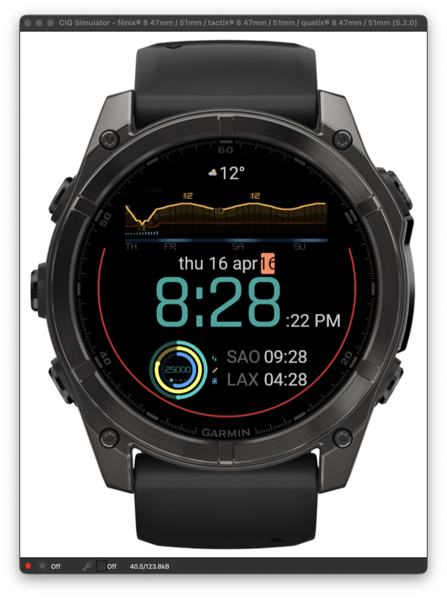
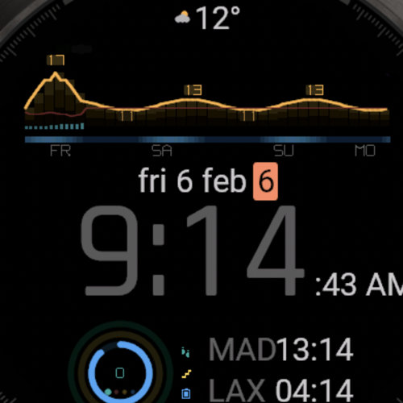
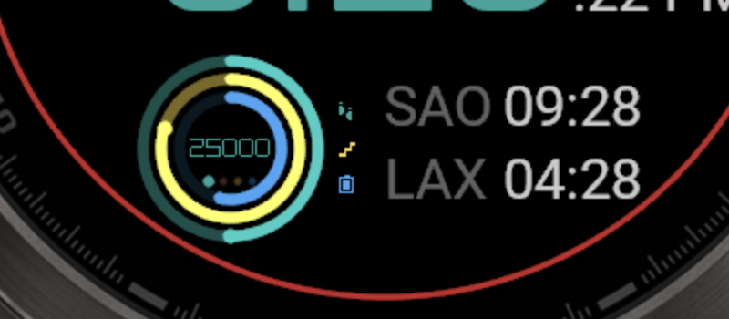

# Rain & Clouds — OLED Weather Watch Face

A minimalist, OLED-optimized weather watch face for Garmin Fenix, Venu, and Epix devices. Built around a 72-hour weather chart, a large readable time digit, and Apple-style activity rings — all on a true-black background for battery savings.

<p align="center">
  
</p>

## Highlights

- **72-hour weather chart** with temperature curve, precipitation bars, cloud cover, and day/night gradient — fed by [Open‑Meteo](https://open-meteo.com/) (no API key required), falling back to the Garmin Weather API.
- **True-black design** (`#000000`) for OLED efficiency — every unlit pixel is an unlit pixel.
- **Apple-style activity rings** with overflow highlight past 100%, and a center value that cycles every 5 seconds through Steps → HR → Floors → Body Battery.
- **Step-goal fill on the time digits** — the time itself fills up as you hit your daily step goal.
- **Two configurable world clocks** (25 cities, auto-fallback if you're already in that timezone).
- **Move bar arc** hugging the bezel — rises symmetrically from 6 o'clock as inactivity grows.
- **Fully themeable** — 4 built-in themes, 5 accent colors, 3 time colors.
- **Dual-platform**: runs on 454×454 AMOLED (Fenix 8) and 240×240 MIP (Fenix 6S) with layout optimizations for each.

## Screenshots

<p align="center">
  
  
</p>

<p align="center">
  
</p>

## Supported devices

| Family | Devices | Display |
|---|---|---|
| Fenix 8 AMOLED | `fenix847mm`, `fenix851mm`, `fenix8solar47mm`, `fenix8solar51mm` | 454×454 |
| Epix (Gen 2) Pro | `epix2pro47mm`, `epix2pro51mm` | 454×454 |
| Venu 2 / 3 | `venu2`, `venu2s`, `venu3`, `venu3s` | 416×416 / 360×360 |
| Fenix 6S MIP | `fenix6s`, `fenix6spro` | 240×240 |

Minimum Connect IQ API level: **3.4.0**.

## Install

### From a release build (sideload)

1. Download the latest `.prg` for your device from [Releases](../../releases).
2. Connect your watch to your Mac/PC via USB.
3. Copy the `.prg` to `GARMIN/APPS/` on the watch storage.
4. Disconnect and select the watch face from the watch's settings.

### Build from source

See [`docs/BUILD.md`](docs/BUILD.md) for the full setup. Quick version:

```bash
# 1. Install the Connect IQ SDK (https://developer.garmin.com/connect-iq/sdk/)
# 2. Install Java 17 and generate your own signing key (instructions in BUILD.md)
# 3. Build + push to the simulator:
./preview.sh fenix847mm
```

## Settings

22 settings grouped into 5 categories, configurable from Connect IQ Mobile:

- **Time & Date** — 12/24h, seconds, date format, ISO week number
- **World Clocks** — 0/1/2 clocks, 25 cities
- **Weather Chart** — toggle each layer (temp, precip, clouds, wind), 48h/72h range, °C/°F
- **Activity Rings** — layout (3/2/off), per-ring data source, icons on/off
- **Appearance** — theme, accent color, time color, battery display rule

## How the weather data works

```
Background service (every 30 min)
   ↓
Position.getInfo()  ← last GPS fix from your activities
   ↓
Open-Meteo API     ← free, no key needed
   ↓
Application.Storage ← cached locally
   ↓
Watch face reads cache on refresh
   ↓ fallback ↓
Garmin Weather API (if Open-Meteo is unreachable)
```

After a factory reset, or if you've never recorded a GPS activity, the face falls back to a default location (Pozuelo de Alarcón, Spain) and shows a small red warning cloud. Go for any outdoor run/ride with GPS and the location updates automatically.

## Credits

- Weather data: [Open-Meteo](https://open-meteo.com/) (free, no key, no registration)
- Inspired by the "Rain & Clouds" watch face for older MIP devices

## License

[MIT](LICENSE) — do what you like, attribution appreciated.

## Contributing

Issues and PRs welcome. See [`CONTRIBUTING.md`](CONTRIBUTING.md) for how to get started and [`docs/BUILD.md`](docs/BUILD.md) for the dev setup.
